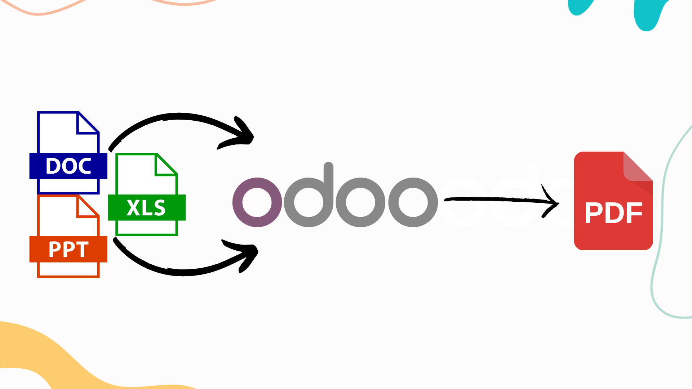

<!-- Improved compatibility of back to top link: See: https://github.com/othneildrew/Best-README-Template/pull/73 -->
<a name="readme-top"></a>
<!--
*** Thanks for checking out the Best-README-Template. If you have a suggestion
*** that would make this better, please fork the repo and create a pull request
*** or simply open an issue with the tag "enhancement".
*** Don't forget to give the project a star!
*** Thanks again! Now go create something AMAZING! :D
-->


<!-- PROJECT SHIELDS -->
<!--
*** I'm using markdown "reference style" links for readability.
*** Reference links are enclosed in brackets [ ] instead of parentheses ( ).
*** See the bottom of this document for the declaration of the reference variables
*** for contributors-url, forks-url, etc. This is an optional, concise syntax you may use.
*** https://www.markdownguide.org/basic-syntax/#reference-style-links
-->

<!-- [![Contributors][contributors-shield]][contributors-url]
[![Forks][forks-shield]][forks-url]
[![Stargazers][stars-shield]][stars-url]
[![Issues][issues-shield]][issues-url]
[![MIT License][license-shield]][license-url]
[![LinkedIn][linkedin-shield]][linkedin-url] -->


<!-- PROJECT LOGO -->
<br />
<div align="center">
<!--   <a href="https://github.com/ertoello">
    
  </a> -->

<h3 align="center">Odoo v16 Module | Converting Document from Odoo v16 using API</h3>

  <p align="center">
    Converting Document from Odoo v16
    <br />
    <!-- <a href="/blob/main/odoo_cloud_mega/static/description/document/odoo_cloud_mega.pdf"><strong>Explore the docs »</strong></a> -->
    <br />
    <br />
    <a href="https://www.convertapi.com/api">View Website API</a>
    ·
    <a href="https://github.com/odoo/odoo/tree/16.0">View Odoo v16 Repo</a>
    <!-- · -->
    <!-- <a href="https://github.com/github_username/repo_name/issues">Request Feature</a> -->
  </p>
</div>


<!-- TABLE OF CONTENTS -->
<details>
  <summary>Table of Contents</summary>
  <ol>
    <li>
      <a href="#about-the-project">About The Project</a>
      <ul>
        <li><a href="#built-with">Built With</a></li>
      </ul>
    </li>
    <li>
      <a href="#getting-started">Getting Started</a>
      <ul>
        <!-- <li><a href="#prerequisites">Prerequisites</a></li> -->
        <li><a href="#installation">Installation</a></li>
      </ul>
    </li>
    <li><a href="#usage">Usage</a></li>
    <!-- <li><a href="#roadmap">Roadmap</a></li>
    <li><a href="#contributing">Contributing</a></li> -->
    <li><a href="#license">License</a></li>
    <li><a href="#contact">Contact</a></li>
    <!-- <li><a href="#acknowledgments">Acknowledgments</a></li> -->
  </ol>
</details>


<!-- ABOUT THE PROJECT -->
## About The Project

<div align="center">
    
</div>

<div align="left">
    <h3>What can this module do? This module can converting document using website API. Which is:
    </h3>
    <ol>
        <li>DOC / DOCX / XLSX -> PDF</li>
        <li>PDF -> DOC / DOCX / XLSX</li>
        <li>JPG / PNG / SVG -> PDF</li>
        <li>PDF -> JPG / PNG / SVG</li>
    </ol>
</div>

<p align="right">(<a href="#readme-top">back to top</a>)</p>


### Built With

<!-- * [![Next][Next.js]][Next-url]
* [![React][React.js]][React-url]
* [![Vue][Vue.js]][Vue-url]
* [![Angular][Angular.io]][Angular-url]
* [![Svelte][Svelte.dev]][Svelte-url]
* [![Laravel][Laravel.com]][Laravel-url]
* [![Bootstrap][Bootstrap.com]][Bootstrap-url]
* [![JQuery][JQuery.com]][JQuery-url] -->
* [![Python][Python]][Python-url]
* [![Odoo][Odoo]][Odoo-url]
<!-- * [![Mega][Mega]][Mega-url] -->

<p align="right">(<a href="#readme-top">back to top</a>)</p>


<!-- GETTING STARTED -->
## Getting Started

<div align="left">
    <h3>What do you need to run this module?
    </h3>
    <ol>
        <li>Odoo v16</li>
        <li>Python 3.8.10</li>
    </ol>
</div>


<!-- ### Prerequisites

This is an example of how to list things you need to use the software and how to install them.
* npm
  ```sh
  npm install npm@latest -g
  ``` -->

### Installation

<!-- 1. <h3><strong>Install mega.py package</strong></h3>
    Run the following command, or run setup from the latest github source.<br/>
    ```sh
    pip install mega.py
    ```

2. <h3><strong>Install humanize package</strong></h3>
    ```sh
    pip install humanize
    ``` -->


1. Install Odoo v16 [Setup instructions](https://www.odoo.com/documentation/16.0/administration/install/install.html)
2. Install convertapi package
   ```sh
   pip install convertapi
   ```
<!-- 3. Install humanize package
   ```sh
   pip install humanize
   ``` -->
<!-- 4. Enter your API in `config.js`
   ```js
   const API_KEY = 'ENTER YOUR API';
   ``` -->

<p align="right">(<a href="#readme-top">back to top</a>)</p>


<!-- USAGE EXAMPLES -->
## Usage

<div align="left">
    <h3>Create a Convertapi account</h3>
    First, <a href="www.convertapi.com">create an account in website ConvertApi</a>.
</div>
<div align="left">
    <h3>Get API Token</h3>
    Login >> Go to user profile >> Authentication >> Generate API Secret >> Copy API Secret
</div>
<div align="left">
    <h3>Addons Directory</h3>
    Download this module or Clone this repo and place the module inside Addons folder Odoo v16
</div>
<div align="left">
    <h3>Login Odoo</h3>
    Login Odoo in your localhost or server with admin account
</div>
<div align="left">
    <h3>Installing Module</h3>
    Go to Apps Menu >> Install odoo_convert_document Module
</div>
<div align="left">
    <h3>Setting up token in Odoo</h3>
    Go to menu Api Settings >> Paste API Secret in field API SECRET KEY >> Click Connect
</div>
<div align="left">
    <h3>Converting document</h3>
    Go to menu Convert File >> Create Record<br/>
    Choose Api Account >> Choose Category<br/>
    Choose From &amp; To Format >> Add line &amp; Choose file from your storage<br/>
    Click Convert
</div>


<!-- _For more examples, please refer to the [Documentation](https://example.com)_ -->

<p align="right">(<a href="#readme-top">back to top</a>)</p>


<!-- ROADMAP -->
<!-- ## Roadmap

- [ ] Feature 1
- [ ] Feature 2
- [ ] Feature 3
    - [ ] Nested Feature

See the [open issues](https://github.com/github_username/repo_name/issues) for a full list of proposed features (and known issues).

<p align="right">(<a href="#readme-top">back to top</a>)</p> -->


<!-- CONTRIBUTING -->
<!-- ## Contributing

Contributions are what make the open source community such an amazing place to learn, inspire, and create. Any contributions you make are **greatly appreciated**.

If you have a suggestion that would make this better, please fork the repo and create a pull request. You can also simply open an issue with the tag "enhancement".
Don't forget to give the project a star! Thanks again!

1. Fork the Project
2. Create your Feature Branch (`git checkout -b feature/AmazingFeature`)
3. Commit your Changes (`git commit -m 'Add some AmazingFeature'`)
4. Push to the Branch (`git push origin feature/AmazingFeature`)
5. Open a Pull Request

<p align="right">(<a href="#readme-top">back to top</a>)</p> -->


<!-- LICENSE -->
## License

Distributed under the MIT License. See `LICENSE.txt` for more information.

<p align="right">(<a href="#readme-top">back to top</a>)</p>


<!-- CONTACT -->
## Contact

Yohanes Serpiyanto Elo - ertoello17fx@gmail.com
<!-- Dewa Firmansyah - [@twitter_handle](https://twitter.com/twitter_handle) - email@email_client.com -->

Project Link: [https://github.com/ertoello](https://github.com/ertoello)

<p align="right">(<a href="#readme-top">back to top</a>)</p>


<!-- ACKNOWLEDGMENTS -->
<!-- ## Acknowledgments

* []()
* []()
* []()

<p align="right">(<a href="#readme-top">back to top</a>)</p> -->


<!-- MARKDOWN LINKS & IMAGES -->
<!-- https://www.markdownguide.org/basic-syntax/#reference-style-links -->
[contributors-shield]: https://img.shields.io/github/contributors/github_username/repo_name.svg?style=for-the-badge
[contributors-url]: https://github.com/github_username/repo_name/graphs/contributors
[forks-shield]: https://img.shields.io/github/forks/github_username/repo_name.svg?style=for-the-badge
[forks-url]: https://github.com/github_username/repo_name/network/members
[stars-shield]: https://img.shields.io/github/stars/github_username/repo_name.svg?style=for-the-badge
[stars-url]: https://github.com/github_username/repo_name/stargazers
[issues-shield]: https://img.shields.io/github/issues/github_username/repo_name.svg?style=for-the-badge
[issues-url]: https://github.com/github_username/repo_name/issues
[license-shield]: https://img.shields.io/github/license/github_username/repo_name.svg?style=for-the-badge
[license-url]: https://github.com/github_username/repo_name/blob/master/LICENSE.txt
[linkedin-shield]: https://img.shields.io/badge/-LinkedIn-black.svg?style=for-the-badge&logo=linkedin&colorB=555
[linkedin-url]: https://linkedin.com/in/linkedin_username
[product-screenshot]: images/screenshot.png
[Next.js]: https://img.shields.io/badge/next.js-000000?style=for-the-badge&logo=nextdotjs&logoColor=white
[Next-url]: https://nextjs.org/
[React.js]: https://img.shields.io/badge/React-20232A?style=for-the-badge&logo=react&logoColor=61DAFB
[React-url]: https://reactjs.org/
[Vue.js]: https://img.shields.io/badge/Vue.js-35495E?style=for-the-badge&logo=vuedotjs&logoColor=4FC08D
[Vue-url]: https://vuejs.org/
[Angular.io]: https://img.shields.io/badge/Angular-DD0031?style=for-the-badge&logo=angular&logoColor=white
[Angular-url]: https://angular.io/
[Svelte.dev]: https://img.shields.io/badge/Svelte-4A4A55?style=for-the-badge&logo=svelte&logoColor=FF3E00
[Svelte-url]: https://svelte.dev/
[Laravel.com]: https://img.shields.io/badge/Laravel-FF2D20?style=for-the-badge&logo=laravel&logoColor=white
[Laravel-url]: https://laravel.com
[Bootstrap.com]: https://img.shields.io/badge/Bootstrap-563D7C?style=for-the-badge&logo=bootstrap&logoColor=white
[Bootstrap-url]: https://getbootstrap.com
[JQuery.com]: https://img.shields.io/badge/jQuery-0769AD?style=for-the-badge&logo=jquery&logoColor=white
[JQuery-url]: https://jquery.com 
[Python]: https://img.shields.io/badge/Python-3.8.10-3776AB.svg?style=for-the-badge&logo=python&logoColor=white
[Python-url]: https://www.python.org
[Odoo]: https://img.shields.io/badge/Odoo-16.0-714B67.svg?style=for-the-badge&logo=odoo&logoColor=#714b67
[Odoo-url]: https://www.odoo.com
[Mega]: https://img.shields.io/badge/build-api-salmon?style=for-the-badge&logo=mega&logoColor=%23D9272E&label=mega
[Mega-url]: https://github.com/odwyersoftware/mega.py
